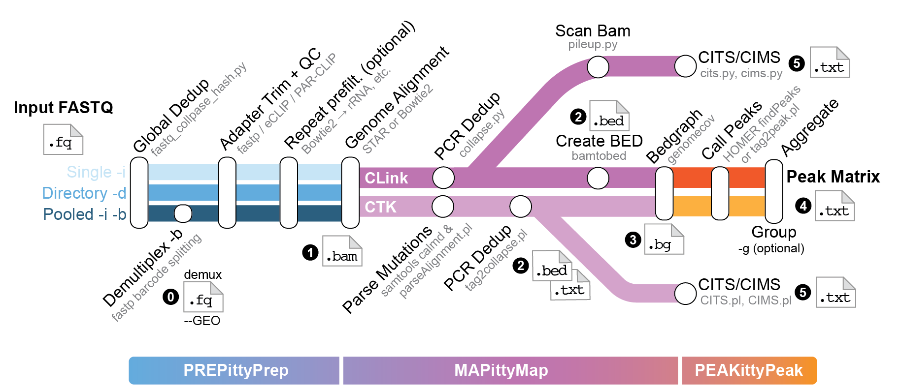

<p align="center">
  
</p>

# CLIPittyClip: Modern CLIP-seq Analysis Pipeline
**Version 3.3.0**

A comprehensive, single-command CLIP-seq analysis pipeline from raw FASTQ to peaks and crosslink sites. Supports iCLIP, eCLIP, and PAR-CLIP protocols.

---

## Table of Contents

1. [Overview](#overview)
2. [Installation](#installation)
3. [Quick Start](#quick-start)
4. [Input Modes](#input-modes)
5. [Output Structure](#output-structure)
6. [Command-Line Reference](#command-line-reference)
7. [Crosslink Site Analysis: CTK and Clink](#crosslink-site-analysis-ctk-and-clink)
8. [eCLIP Modes](#eclip-modes)
9. [Standalone Tools](#standalone-tools)
10. [Genome Index Setup](#genome-index-setup)
11. [Peak Matrix Metrics](#peak-matrix-metrics)
12. [Changelog](#changelog)

---

## Overview

<p align="center">
  
</p>

CLIPittyClip runs the complete CLIP-seq stack in a single command:

- **Preprocessing** — exact-sequence deduplication, demultiplexing, adapter trimming (fastp)
- **Alignment** — STAR (splice-aware, default) or Bowtie2
- **Coverage** — RPM-normalized strand-specific bedgraphs; group-averaged tracks
- **Peak calling** — HOMER (default) or CTK `tag2peak.pl`; per-sample and aggregated
- **Crosslink sites** — CITS (truncation) and CIMS (deletion/substitution) via:
  - **CTK** — `parseAlignment.pl` + `CITS.pl` / `CIMS.pl` (Perl, standard)
  - **Clink** — `pileup.py` + `cits.py` / `cims.py` (Python, v3.3 new)

---

## Installation

> [!WARNING]
> **macOS:** STAR `2.7.11b` is broken on macOS Tahoe via Rosetta. Pin to `2.7.10b`:
> `mamba install bioconda::star=2.7.10b`

### 1. Clone

```bash
git clone -b v3.3 https://github.com/LunaRNALab/CLIPittyClip.git
cd CLIPittyClip
```

### 2. Install

**macOS (Intel or Apple Silicon):**
```bash
./install_macos.sh --env clipittyclip --tools-dir ~/Tools
```

**Linux:**
```bash
./install_linux.sh --env clipittyclip --tools-dir ~/Tools
```

The scripts create a `clipittyclip` conda environment with all dependencies: STAR, Bowtie2, samtools, fastp, CTK, HOMER, Perl modules (Math::CDF, Bio::SeqIO), and Python packages (pysam, numpy, scipy, umi_tools).

| Option | Default | Description |
|--------|---------|-------------|
| `--env <name>` | `clipittyclip` | Conda environment name |
| `--tools-dir <path>` | `~/Tools` | Directory for CTK and HOMER |

### 3. Activate and verify

```bash
source ~/.zshrc          # or ~/.bashrc on Linux
conda activate clipittyclip

# Verify
which CLIPittyClip.sh
which parseAlignment.pl
which findPeaks
perl -MMath::CDF -e 'print "Math::CDF OK\n"'
python3 -c "import pysam; print('pysam OK')"
umi_tools --version
```

---

## Quick Start

```bash
# Single sample — STAR alignment
CLIPittyClip.sh -i reads.fastq.gz -x /path/to/star_index -t 8

# With UMI length
CLIPittyClip.sh -i reads.fastq.gz -x /path/to/star_index -t 8 -u 7

# Pooled library — demultiplex first, then analyze each sample
CLIPittyClip.sh -i pool.fastq.gz -b barcodes.txt -x /path/to/star_index -t 8

# Pre-demultiplexed folder — batch mode
CLIPittyClip.sh -d /path/to/samples/ -x /path/to/star_index -t 8

# Crosslink sites with Clink (recommended, v3.3)
CLIPittyClip.sh -i reads.fastq.gz -x /path/to/star_index \
    --genome-fasta /path/to/genome.fa -t 8 --run-clink

# Head-to-head: CTK vs Clink on the same data
CLIPittyClip.sh -i reads.fastq.gz -x /path/to/star_index \
    --genome-fasta /path/to/genome.fa -t 8 --run-cims-cits --run-clink

# eCLIP paired-end
CLIPittyClip.sh --eclip pe -d /path/to/eclip_r2s/ -x /path/to/star_index -t 8 --run-clink
```

---

## Input Modes

| Mode | Flags | Use Case |
|------|-------|----------|
| Single file | `-i sample.fastq.gz` | One FASTQ, direct analysis |
| Pooled + barcodes | `-i pool.fastq.gz -b barcodes.txt` | Demultiplex then analyze each sample |
| Pre-demuxed folder | `-d /path/to/folder/` | Batch-analyze a set of FASTQs |

CLIPittyClip accepts both `.fastq.gz` and plain `.fastq` / `.fq` inputs in all modes.

---

## Output Structure

All results land in a single numbered-folder hierarchy next to your input (or at `-o`).

```
{INPUT}_output/
├── 0_DEMUX_FASTQ/          ← demultiplexed reads (only with -k)
├── 1_BAM/                  ← sorted, indexed BAM files
├── 2_COLLAPSED_BED/        ← PCR-deduplicated read BED
├── 3_BEDGRAPH/             ← RPM-normalized ± strand bedgraphs
│   └── COMBINED_BEDGRAPH/  ← group-averaged tracks (with -g)
├── 4_PEAKS/
│   ├── SAMPLE_PEAKS/       ← per-sample peak calls
│   └── COMBINED_PEAKS/     ← aggregated peaks + COMBINED_PEAK_MATRIX.txt
│
├── 5_CTK_Analysis/         ← CTK crosslink sites (--run-cims-cits)
│   └── {sample}/CIMS/ CITS/
│
├── 5_Clink/ or 6_Clink/   ← Clink crosslink sites (--run-clink)
│   └── {sample}/
│       ├── {sample}_dedup.bam
│       ├── {sample}_pileup.npz
│       ├── {sample}_truncations.bed
│       ├── {sample}_deletions.bed
│       └── {sample}_TtoC.bed  (+ all 12 substitution types)
│
├── 6_OTHERS/ or 7_OTHERS/  ← intermediate files; number adjusts automatically
│   ├── STAR_OUTPUT/
│   └── ncRNA_Mapping/
│
└── REPORTS/
    ├── FASTP_REPORT/        ← HTML/JSON QC
    ├── ALIGNER_LOGS/        ← STAR/Bowtie2 summaries
    ├── PEAK/                ← peak calling logs
    └── SAMPLES/             ← per-sample detailed logs
```

> **Folder numbering** adjusts automatically: `5_OTHERS` with no crosslink analysis, `6_OTHERS` with CTK or Clink, `7_OTHERS` with both.

**Output location (`-o`):**
- No `-o`: created next to input (`/data/reads.fq.gz` → `/data/reads_output/`)
- Name only (`-o HepG2`): created next to input as `/data/HepG2/`
- Full path (`-o /results/HepG2`): exact path used

---

## Command-Line Reference

Run `CLIPittyClip.sh --help` for full usage.

### Input / Output

| Short | Long | Default | Description |
|-------|------|---------|-------------|
| `-i` | `--input-file` | — | Input FASTQ (required unless using `-d`) |
| `-d` | `--input-dir` | — | Directory of pre-demultiplexed FASTQs |
| `-x` | `--index` | — | Genome index directory (required) |
| `-o` | `--output` | next to input | Output folder name or full path |
| `-k` | `--keep` | off | Keep intermediate files |

### Alignment

| Long | Default | Description |
|------|---------|-------------|
| `-m` / `--mapper` | `star` | Aligner: `star` or `bowtie2` |
| `-t` / `--threads` | `1` | Number of threads |
| `--genome-fasta` | — | Reference FASTA — enables `samtools calmd` for accurate MD tags; strongly recommended for crosslink site analysis |
| `--align-mismatches` | `2` | Absolute mismatch backstop (STAR; primary filter is fractional 10% of read length) |

### Preprocessing

| Short | Long | Default | Description |
|-------|------|---------|-------------|
| `-u` | `--umi-length` | auto | UMI length in bases |
| `-a` | `--adapter` | L32 | 3' adapter sequence |
| `-b` | `--barcodes` | — | Barcode file (enables demultiplexing) |
| — | `--demux-mismatches` | `1` | Max barcode mismatches |
| — | `--eclip` | — | eCLIP mode: `pe` (paired-end) or `se` (single-end) |
| — | `--no-dedup` | — | Skip FASTQ deduplication |
| — | `--filter-ncrna` | off | Pre-filter ncRNA reads (opt-in) |
| — | `--bc-len` | — | Barcode length (auto-detected from `-b`) |
| — | `--spacer-len` | `0` | Spacer bases after barcode |

### Peak Calling

| Long | Default | Description |
|------|---------|-------------|
| `--peak-caller` | `homer` | Peak caller: `homer` or `ctk` |
| `--peak-caller-args` | — | Extra arguments passed to peak caller (quoted string) |
| `-f` / `--flank` | `10` | Flanking nucleotides for motif BED |
| `--no-motif` | — | Skip flanked BED generation |

### Grouping

| Short | Long | Default | Description |
|-------|------|---------|-------------|
| `-g` | `--groups` | — | Groups file for bedgraph/peak aggregation (`SampleName\tGroupName`) |
| — | `--ctk-group` | off | Pool samples by group before running CTK crosslink analysis |

### Crosslink Site Analysis

#### CTK (standard)

| Long | Default | Description |
|------|---------|-------------|
| `--run-cims-cits` | off | Enable full CTK CIMS + CITS |
| `--run-cims` | off | CIMS only (mutation/deletion sites) |
| `--run-cits` | off | CITS only (truncation sites) |
| `--cims-iter` | `5` | CIMS permutation iterations |
| `--cims-fdr` | `0.05` | CIMS FDR threshold |
| `--cits-pval` | `0.05` | CITS p-value threshold |
| `--cits-gap` | `25` | CITS clustering gap (`-1` disables) |

#### Clink (v3.3)

| Long | Default | Description |
|------|---------|-------------|
| `--run-clink` | off | Enable Clink crosslink site analysis |
| `--clink-umi-len` | auto | UMI length for umi_tools (auto-detected if omitted) |
| `--clink-fdr` | `0.05` | Benjamini-Hochberg FDR threshold |
| `--clink-min-cov` | `5` | Minimum coverage to test a position |

### Other

| Short | Long | Default | Description |
|-------|------|---------|-------------|
| `-s` | `--sample` | — | Test mode: process only first N reads |
| `-w` | `--wizard` | — | Launch interactive configuration wizard |
| — | `--notification` | off | System notification on completion |
| `-v` | `--verbose` | off | Verbose logging |
| `-h` | `--help` | — | Show help |

---

## Crosslink Site Analysis: CTK and Clink

CLIPittyClip supports two crosslink site callers. Both can run in the same command for direct comparison.

### How they differ

| Step | CTK | Clink |
|------|-----|-------|
| BAM deduplication | `tag2collapse.pl` — EM algorithm (~48% reads retained) | `umi_tools directional` — conservative graph collapse (~80% retained) |
| Signal extraction | `parseAlignment.pl` — BAM → BED → mutation file | `pileup.py` — single BAM scan → `.npz` (shared by CITS + CIMS) |
| Truncation sites | `CITS.pl` — binomial test | `cits.py` — binomial test + Benjamini-Hochberg FDR |
| Mutation/deletion sites | `CIMS.pl` — binomial test | `cims.py` — deletions + all 12 substitution types |
| Bedgraph / peaks | BAM-based, unchanged | BAM-based, unchanged |

### Running CTK

```bash
# Both CIMS and CITS
CLIPittyClip.sh -i reads.fastq.gz -x /path/to/star_index \
    --genome-fasta /path/to/genome.fa -t 8 --run-cims-cits

# CITS only (truncation sites — iCLIP primary signal)
CLIPittyClip.sh -i reads.fastq.gz -x /path/to/star_index \
    --genome-fasta /path/to/genome.fa -t 8 --run-cits
```

Output: `5_CTK_Analysis/{sample}/CITS/` and `CIMS/`

### Running Clink

```bash
# Single sample
CLIPittyClip.sh -i reads.fastq.gz -x /path/to/star_index \
    --genome-fasta /path/to/genome.fa -t 8 --run-clink

# Batch
CLIPittyClip.sh -d /path/to/samples/ -x /path/to/star_index \
    --genome-fasta /path/to/genome.fa -t 8 --run-clink
```

Output: `5_Clink/{sample}/` containing:
- `{sample}_dedup.bam` — umi_tools-deduplicated BAM
- `{sample}_pileup.npz` — compressed pileup (shared by CITS + CIMS)
- `{sample}_truncations.bed` — significant truncation sites
- `{sample}_deletions.bed` — significant deletion sites
- `{sample}_TtoC.bed` etc. — one file per substitution type (all 12 types)

### Head-to-head comparison

Run both in one command to compare CTK and Clink on the same dataset:

```bash
CLIPittyClip.sh -i reads.fastq.gz -x /path/to/star_index \
    --genome-fasta /path/to/genome.fa -t 8 \
    --run-cims-cits --run-clink
```

This produces `5_CTK_Analysis/` and `6_Clink/` from the same aligned BAM. Both pipelines are fully independent — different deduplication, different signal extraction, same statistical framework.

### STAR alignment tuning for crosslink site analysis

CLIPittyClip tunes STAR specifically so reads carrying crosslink-induced deletions survive alignment.

**Why `--genome-fasta` matters:**
STAR index directories do not store the source FASTA. Without it, `samtools calmd` cannot recalculate MD tags, and STAR's native MD at deletion boundaries can be inconsistent — causing `parseAlignment.pl` (CTK) or `pileup.py` (Clink) to miss genuine crosslink deletions. Provide `--genome-fasta /path/to/genome.fa` to enable authoritative MD recalculation.

**STAR parameters applied automatically:**

| Parameter | Value | Rationale |
|-----------|-------|-----------|
| `--outFilterMismatchNoverReadLmax` | `0.1` | Fractional filter (10% of read length): ~3 mismatches in 30 bp, ~2 in 20 bp. Replaces the old hard limit of 2 which discarded reads with a crosslink deletion + 2 sequencing errors (NM = 3). |
| `--outFilterMismatchNmax` | `5` | Hard backstop only. |
| `--scoreDelOpen` / `--scoreDelBase` | `-1` | Lowers deletion penalty to match substitution cost. STAR's default (`-2/-2`) makes 1-nt crosslink deletions score worse than mismatches on short iCLIP reads, causing them to be realigned as substitutions. |
| `--scoreInsOpen` / `--scoreInsBase` | `-1` | Symmetric insertion penalty. |

> **Bowtie2 note:** Bowtie2 is not splice-aware and its gap penalties are not tuned for crosslink deletions. A warning is emitted automatically when Bowtie2 + crosslink site analysis are combined. STAR is strongly recommended.

### Group-based crosslink analysis (CTK)

Pool replicates before running CTK to increase power:

```bash
CLIPittyClip.sh -i pool.fq.gz -b barcodes.txt -x index \
    --run-cims-cits -g groups.txt --ctk-group
```

**groups.txt format** (tab-separated):
```
Condition_A_Rep1    Condition_A
Condition_A_Rep2    Condition_A
Condition_B_Rep1    Condition_B
Condition_B_Rep2    Condition_B
```

Samples not listed are analyzed individually.

> [!WARNING]
> Group-based CTK aggregates all samples before running CIMS/CITS. This can require >64 GB RAM for large datasets.

---

## eCLIP Modes

Select with `--eclip pe` or `--eclip se`.

### Paired-end eCLIP (`--eclip pe`)

For ENCODE eCLIP data after inline-barcode demultiplexing by `eclipdemux`. Supply **Read 2** (cross-link site end) with UMI in the header (`@NTACGTTGAT:NB501168:...`).

```bash
CLIPittyClip.sh --eclip pe -d /path/to/eclip_r2s/ -x /path/to/star_index -t 8 --run-clink
```

Preprocessing: validate R2 format → UMI to sequence → hash dedup → extract UMI → fastp (full eCLIP adapter set).

### Single-end eCLIP (`--eclip se`)

For seCLIP data (Blue et al. 2022). Supply raw **Read 1** — UMI is the first 10 nt of the read sequence. UMI length and adapter are hardcoded (10 nt; TruSeq R1).

```bash
CLIPittyClip.sh --eclip se -i sample_R1.fastq.gz -x /path/to/star_index -t 8
```

Preprocessing: validate R1 format → hash dedup → extract UMI → fastp (TruSeq R1 adapter).

---

## Standalone Tools

### PREPittyPrep.sh

Preprocessing only — dedup → demux (optional) → fastp → ready-to-map FASTQs. No genome index required.

```bash
# Single FASTQ
PREPittyPrep.sh -i reads.fastq.gz -u 7 -t 8

# Pooled library + demux
PREPittyPrep.sh -i pool.fastq.gz -b barcodes.txt -u 7 -t 8

# Batch directory
PREPittyPrep.sh -d /path/to/samples/ -u 7 -t 8

# GEO deposit: raw barcode split, no modification, MD5 checksums
PREPittyPrep.sh -i pool.fastq.gz -b barcodes.txt --geo -o my_GEO
```

Output: `{INPUT}_prepped/PREPPED_FASTQ/*_prepped.fastq.gz` + `REPORTS/`

GEO output: `{INPUT}_GEO/{sample}.fastq.gz` + `md5sums.txt`

Key options: `-u` (UMI length), `-b` (barcodes), `-a` (adapter), `--bc-len`, `--spacer-len`, `--no-dedup`, `--geo`, `--filter-ncrna`, `-k`

---

### MAPittyMap.sh

Standalone alignment — FASTQ → sorted BAM.

```bash
# STAR
MAPittyMap.sh -i reads.fastq.gz -x /path/to/star_index -t 8

# Bowtie2
MAPittyMap.sh -i reads.fastq.gz -x /path/to/bt2_index -t 8 -m bowtie2

# Interactive wizard for custom settings
MAPittyMap.sh -i reads.fastq.gz -x /path/to/star_index -w
```

Key options: `-i`, `-x` (required), `-t`, `-m` (star/bowtie2), `-o`, `--genome-fasta`, `-w`

---

### PEAKittyPeak.sh

Standalone peak calling from a directory of collapsed BED files.

```bash
# Aggregated peaks (HOMER)
PEAKittyPeak.sh -i ./2_COLLAPSED_BED -n Combined --aggregate

# Aggregated peaks (CTK tag2peak.pl)
PEAKittyPeak.sh -i ./2_COLLAPSED_BED -n Combined --aggregate --peak-caller ctk

# With crosslink site counts added to matrix
PEAKittyPeak.sh -i ./2_COLLAPSED_BED -n Combined --aggregate \
    --ctk-dir ./5_CTK_Analysis/

# Interactive wizard
PEAKittyPeak.sh --wizard
```

Key options: `-i` (BED dir), `-n` (output prefix), `--aggregate` / `--no-aggregate`, `--peak-caller`, `--peak-caller-args`, `--ctk-dir`, `--ctk-group`, `-p` (min peak distance), `-z` (peak size), `-f` (fragment length)

---

## Genome Index Setup

### STAR index
```bash
STAR --runMode genomeGenerate \
     --runThreadN 8 \
     --genomeDir /path/to/star_index \
     --genomeFastaFiles genome.fa \
     --sjdbGTFfile annotation.gtf \
     --sjdbOverhang 100
```

### Bowtie2 index
```bash
bowtie2-build genome.fa /path/to/bt2_index/GRCh38
```

### ncRNA pre-filtering index (optional)

Filters rRNA, tRNA, snRNA, snoRNA before genome alignment. Enable with `--filter-ncrna`.

```bash
# Download ncRNA sequences (human GRCh38)
wget ftp://ftp.ensembl.org/pub/release-110/fasta/homo_sapiens/ncrna/Homo_sapiens.GRCh38.ncrna.fa.gz
gunzip Homo_sapiens.GRCh38.ncrna.fa.gz

# Build Bowtie2 index — place in ncRNA/ subfolder of your annotation dir
mkdir -p /path/to/annotation/ncRNA
bowtie2-build Homo_sapiens.GRCh38.ncrna.fa /path/to/annotation/ncRNA/ncrna
```

### Recommended annotation directory layout

```
/path/to/annotation/
├── genome.fa                 ← pass to --genome-fasta
├── Genome                    ← STAR index files
├── SA, SAindex, genomeParameters.txt
├── chrom.sizes               ← optional, for bedgraph
└── ncRNA/
    ├── ncrna.1.bt2
    └── ncrna.*.bt2
```

---

## Peak Matrix Metrics

`COMBINED_PEAK_MATRIX.txt` contains up to 54+ metrics per peak:

| Metric | Prefix | Scope | Description |
|--------|--------|-------|-------------|
| Biological Complexity | `BC_` | Group | Samples in group with raw count > 0 — measures reproducibility |
| Total Count (raw) | `TC_` | Sample | Raw read starts overlapping the peak |
| Total Count (aggregate) | `TC_` | Group | Sum of raw counts across all group samples |
| Normalized Count | `NormedTC_` | Sample | RPM: `raw TC × (1,000,000 / mapped reads)` |
| Normalized Count (aggregate) | `NormedTC_` | Group | Sum of RPM-normalized counts across group |
| Coverage Sum | `CovSum_` | Sample | Sum of per-base bedgraph signal across peak |
| Coverage Sum (group avg) | `CovSum_` | Group | Per-base signal from group-averaged bedgraph |
| Coverage Mean | `CovMean_` | Both | `CovSum / peak length` |
| Coverage Max | `CovMax_` | Both | Highest single-base signal in peak |

> **NormedTC** (additive) measures total group intensity. **Cov** columns (mean-based) measure signal density and shape of the average replicate.

---

## Changelog

### v3.3.0
- **Clink pipeline** (`--run-clink`): Python-native crosslink site caller
  - `umi_tools directional` deduplication — more conservative than `tag2collapse.pl` EM algorithm
  - `pileup.py`: single BAM scan → `.npz` shared between CITS and CIMS (no duplicate scanning)
  - `cits.py`: truncation site calling with binomial test + Benjamini-Hochberg FDR
  - `cims.py`: deletions + all 12 substitution types from one pileup
  - `--run-cims-cits --run-clink` runs both pipelines for direct comparison
  - Output folder numbering adjusts automatically (5_Clink or 6_Clink)
  - Hard dependency check at startup with clear install instructions
- Install scripts: `pysam` and `umi_tools` added; Python pinned to `<3.13`

### v3.2.0
- **`--genome-fasta` flag**: explicit reference FASTA for `samtools calmd` (STAR never stores FASTA in its index directory)
- **STAR mismatch tuning**: fractional `--outFilterMismatchNoverReadLmax 0.1` replaces hard `--outFilterMismatchNmax 2`; symmetric `--scoreInsOpen/Base -1` added
- **`scale_factors.tsv` reset** before batch aggregation to prevent peak matrix corruption on reruns
- macOS AppleDouble fix (`._*`) in BAM/BED `find` commands
- Warning emitted when Bowtie2 + crosslink analysis are combined
- Hash-based FASTQ dedup engine (`lib/fastq_collapse_hash.py`) — O(n), no disk spill
- `PREPittyPrep.sh`: standalone preprocessing + GEO deposit mode
- Lazy gzip: internal steps use plain `.fastq`; compression only at final output
- Conditional `0_DEMUX_FASTQ`: only retained with `-k`

### v3.1.0 / v3.0.2
- `--peak-caller` flag: `homer` (default) or `ctk`
- UCSC track headers added to all bedgraph outputs
- Plain `.fastq` / `.fq` support in `-i` and `-d` modes
- `--run-cims-cits` replaces `--run-ctk` (deprecated alias preserved)
- Interactive wizard supports peak caller selection
- Organized numbered output folders in single-file mode
- Bug fixes: batch mode dedup inheritance, peak aggregation, log file paths

---

## License

GPL-3.0 — See [LICENSE](LICENSE) for details.
