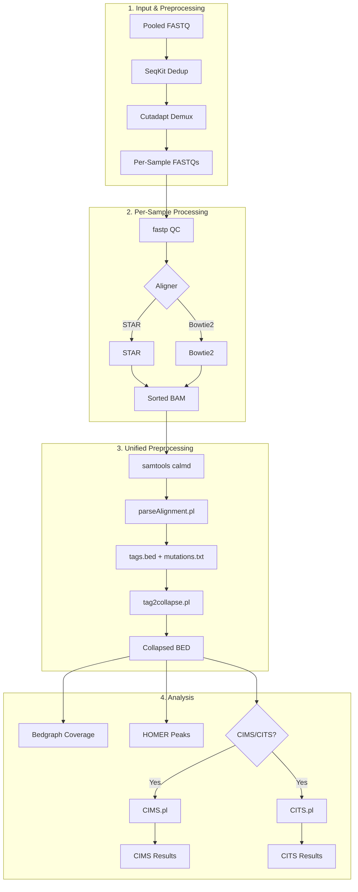

<p align="center">
  
</p>

# CLIPittyClip: Modern CLIP-seq Analysis Pipeline
**Version 3.0.0**

A comprehensive, single-command CLIP-seq data analysis pipeline from FASTQ to peaks and crosslink sites.

## Overview

CLIPittyClip v3.0 provides a complete, modernized workflow for CLIP-seq analysis:

- **Dual Aligner Support**: STAR (default) or Bowtie2 (with smart index prioritization)
- **Unified Preprocessing**: `samtools calmd` → `parseAlignment.pl` → `tag2collapse.pl`
- **Advanced Coverage Analysis**: Normalized BedGraph generation (CPM) with junction read removal (CIGAR filtering) and group averaging
- **Integrated QC**: `fastp` for quality filtering, trimming, and UMI extraction
- **Demultiplexing**: Native barcode-based sample splitting with `cutadapt`
- **Dual-Mode Peak Calling**: Robust `PEAKittyPeak` module supporting aggregated (meta-peak) or individual calling without filesystem limitations
- **Group-Based Analysis**: Integrated support for group-wise peak aggregation and CTK analysis
- **Flexible Reporting**: Centralized `REPORTS/` folder with detailed logs and stats
- **Interactive Wizard**: `--wizard` mode for guided configuration

## Pipeline Flow



> **Note**: Unified preprocessing always runs, generating `mutations.txt` for CIMS/CITS compatibility.

## Installation

> ⚠️ **Development Version**: This is the `v3-development` branch. For the stable release, use the `main` branch.

### 1. Clone Repository
```bash
git clone -b v3-development https://github.com/S00NYI/CLIPittyClip.git
cd CLIPittyClip
```

### 2. Create Conda Environment

> **Note:** Replace `[ENV_NAME]` with your preferred environment name (e.g., `clipittyclip`, `clip_env`, etc.)

#### Linux
```bash
mamba env create -n [ENV_NAME] -f install_linux.yml
```

#### macOS (Intel or Apple Silicon)

> [!IMPORTANT]
> **Why macOS requires special installation:**
> 
> The CTK (CLIP Tool Kit) and HOMER packages have incompatible Perl version requirements:
> - **CTK** requires `perl >=5.32.1`
> - **HOMER** requires `perl 5.22.0` or `perl 5.26.x`
> 
> Additionally, some CTK dependencies (like `xopen` via `cutadapt`) have broken builds for macOS on conda channels. These conflicts make it impossible to install both packages via conda on macOS.
> 
> The workaround is to:
> 1. Install core dependencies via conda (using x86 emulation via Rosetta 2)
> 2. Install CTK and HOMER manually from source

```bash
# Step 1: Create environment with x86 architecture (required for Rosetta compatibility)
CONDA_SUBDIR=osx-64 mamba create -n [ENV_NAME]
conda activate [ENV_NAME]
conda config --env --set subdir osx-64

# Step 2: Install core packages
mamba env update -f install_macos.yml

# Step 3: Install CTK and HOMER manually (see Section 3 below)
```

### 3. macOS: Manual CTK & HOMER Installation

> **Note:** The commands below install to `~/Tools/`. If this directory doesn't exist, it will be created automatically. You can change the installation path to any location you prefer.

**CTK (CLIP Tool Kit):**
```bash
# Create Tools directory if it doesn't exist
mkdir -p ~/Tools

# Clone CTK repository
git clone https://github.com/chaolinzhanglab/ctk.git ~/Tools/ctk

# Add CTK to your PATH and PERL5LIB
echo 'export PATH=$PATH:~/Tools/ctk' >> ~/.zshrc
echo 'export PERL5LIB=$PERL5LIB:~/Tools/ctk/czplib' >> ~/.zshrc
source ~/.zshrc
```

**HOMER:**
```bash
# Create HOMER directory and download installer
mkdir -p ~/Tools/homer && cd ~/Tools/homer
wget http://homer.ucsd.edu/homer/configureHomer.pl

# Install HOMER (this will download required data files)
perl configureHomer.pl -install

# Add HOMER to your PATH
echo 'export PATH=$PATH:~/Tools/homer/bin' >> ~/.zshrc
source ~/.zshrc
```

### 4. Activate Environment
```bash
# Replace [ENV_NAME] with the name you chose in Step 2
conda activate [ENV_NAME]

# Example:
# conda activate clipittyclip
```

### 5. Add CLIPittyClip to PATH (Optional)

To run CLIPittyClip commands from any directory:

```bash
# For zsh (macOS default)
bash install_zshrc.sh

# For bash (Linux default)
bash install_bashrc.sh
```

This adds the CLIPittyClip directory to your PATH and sets execute permissions on all scripts.

> **Note:** Restart your terminal or run `source ~/.zshrc` (or `source ~/.bashrc`) for the changes to take effect.

## Quick Start

```bash
# Basic analysis with STAR (single file)
CLIPittyClip.sh -i reads.fastq.gz -x /path/to/star_index -t 8 -u 7

# With demultiplexing
CLIPittyClip.sh -i pool.fastq.gz -b barcodes.txt -x /path/to/star_index -t 8

# Pre-demultiplexed samples in a folder
CLIPittyClip.sh -d /path/to/samples_folder/ -x /path/to/star_index -t 8

# Using Bowtie2 instead
CLIPittyClip.sh -i reads.fastq.gz -x /path/to/bt2_index -t 8 -m bowtie2

# With CIMS analysis only
CLIPittyClip.sh -i reads.fastq.gz -x /path/to/star_index -t 8 --run-cims

# With CITS analysis only
CLIPittyClip.sh -i reads.fastq.gz -x /path/to/star_index -t 8 --run-cits

# With both CIMS and CITS analysis
CLIPittyClip.sh -i reads.fastq.gz -x /path/to/star_index -t 8 --run-ctk
# OR equivalently:
CLIPittyClip.sh -i reads.fastq.gz -x /path/to/star_index -t 8 --run-cims --run-cits

# ENCODE eCLIP analysis (pre-processed files with UMI in header)
CLIPittyClip.sh --eclip -d /path/to/samples/ -x /path/to/star_index -t 8 --run-cims --run-cits
```

## ENCODE eCLIP Mode

For pre-processed ENCODE eCLIP data, use `--eclip` mode:

```bash
# eCLIP preprocessing only
CLIPittyClip.sh --eclip -d /path/to/eclip_fastqs/ -x /path/to/star_index -t 8

# eCLIP with CIMS/CITS analysis (optional, add flags as needed)
CLIPittyClip.sh --eclip -d /path/to/eclip_fastqs/ -x /path/to/star_index -t 8 --run-cims --run-cits
```

**What `--eclip` does (preprocessing only):**
- **Skips UMI extraction** - UMI is already in read header (ENCODE format: `@NCCTGAATGA:...`)
- **Uses 9 standard eCLIP adapters** - Automatically trims all adapter variants
- **Reformats headers for CTK** - Converts to CTK-compatible format for tag2collapse

> **Note:** `--eclip` only affects preprocessing. CIMS/CITS analysis requires separate `--run-cims` and/or `--run-cits` flags.

> **Note:** Dynamic thread scaling for CIMS/CITS (based on available RAM) applies to all modes, not just eCLIP.

**When to use:**
- ENCODE eCLIP data downloaded from `encodeproject.org`
- Files with UMI already moved to read ID (format: `@UMI:REST_OF_ID`)
- Pre-demultiplexed eCLIP samples

**Ignored options in eCLIP mode:**
- `-u` (UMI length) - Detected from header
- `-a` (adapter) - Uses all 9 eCLIP adapters

## Input Modes

| Mode | Flag | Use Case |
|------|------|----------|
| Single file | `-i sample.fastq.gz` | One FASTQ, direct analysis |
| Pooled + barcodes | `-i pool.fastq.gz -b barcodes.txt` | Demultiplex then analyze |
| Pre-demuxed folder | `-d /path/to/folder/` | Batch analyze existing FASTQs |

## Command-Line Options

Run `CLIPittyClip.sh --help` for full usage.

### Input/Output Options

| Short | Long | Type | Default | Description |
|-------|------|------|---------|-------------|
| `-i` | `--input-file` | path | — | Input FASTQ file (required unless using `-d`) |
| `-d` | `--input-dir` | path | — | Input directory with pre-demultiplexed FASTQs |
| `-x` | `--index` | path | — | Genome index directory (required) |
| `-o` | `--output` | string | derived from input | Output folder name |
| `-k` | `--keep` | bool | no | Keep intermediate files |

### Processing Options

| Short | Long | Type | Default | Description |
|-------|------|------|---------|-------------|
| `-t` | `--threads` | int | 1 | Number of threads |
| `-m` | `--mapper` | string | star | Mapper: `star` or `bowtie2` |
| `-v` | `--verbose` | bool | false | Enable verbose logging |
| `-h` | `--help` | — | — | Show help message |

### Preprocessing Options

| Short | Long | Type | Default | Description |
|-------|------|------|---------|-------------|
| `-u` | `--umi-length` | int | — | UMI length (auto-detected for eCLIP) |
| `-a` | `--adapter` | string | L32 | 3' adapter sequence |
| — | `--eclip` | bool | false | ENCODE eCLIP mode |
| — | `--no-dedup` | bool | — | Disable FASTQ deduplication (default: ON) |

### Demultiplexing Options

| Short | Long | Type | Default | Description |
|-------|------|------|---------|-------------|
| `-b` | `--barcodes` | path | — | Barcode file (enables demultiplexing) |
| — | `--demux-mismatches` | int | 1 | Max barcode mismatches |
| — | `--align-mismatches` | int | 2 | Max alignment mismatches (STAR only) |
| — | `--skip-ncrna` | bool | false | Disable ncRNA pre-filtering |

### CTK Analysis Options

| Short | Long | Type | Default | Description |
|-------|------|------|---------|-------------|
| — | `--run-ctk` | bool | — | Enable full CTK CIMS+CITS analysis |
| — | `--run-cims` | bool | — | Enable CIMS analysis (mutation sites) |
| — | `--run-cits` | bool | — | Enable CITS analysis (truncation sites) |
| — | `--cims-iter` | int | 5 | CIMS permutation iterations |
| — | `--cims-fdr` | float | 0.05 | CIMS FDR threshold |
| — | `--cits-pval` | float | 0.05 | CITS p-value threshold |
| — | `--cits-gap` | int | 25 | CITS clustering gap (-1 disables) |
| `-f` | `--flank` | int | 10 | Flanked BED nucleotides |
| — | `--no-motif` | bool | — | Skip flanked BED generation |

### Grouping Options

| Short | Long | Type | Default | Description |
|-------|------|------|---------|-------------|
| `-g` | `--groups` | path | — | Groups file for bedgraph/peak grouping |
| — | `--ctk-group` | bool | false | Enable group CTK analysis |

### Other Options

| Short | Long | Type | Default | Description |
|-------|------|------|---------|-------------|
| — | `--notification` | bool | false | Enable system notifications |
| `-w` | `--wizard` | bool | — | Launch interactive wizard |
| `-s` | `--sample` | int | — | Test mode: process only first N reads |

## Group-Based CIMS/CITS Analysis

Use `--ctk-group` with `-g groups.txt` to aggregate replicates/samples before running CIMS/CITS:

```bash
CLIPittyClip.sh -i pool.fq.gz -b barcodes.txt -x index --run-cims --run-cits -g groups.txt --ctk-group
```

**groups.txt format** (tab-separated: `SampleName<TAB>GroupName`):
```
Condition_A_Rep1    Condition_A
Condition_A_Rep2    Condition_A
Condition_B_Rep1    Condition_B
Condition_B_Rep2    Condition_B
```

> **Note:** Samples not listed in the groups file are treated as individual groups (analyzed separately).

> [!WARNING]
> **Memory Requirements:** Group-based CTK analysis aggregates all samples in each group before running CIMS/CITS, which can require significant memory (>64GB RAM recommended for large datasets). If you encounter memory issues or system crashes, consider:
> - Running CTK on individual samples instead of groups
> - Using a machine with more RAM

## Output Structure

```
{INPUT}_output/
├── 0_DEMUX_FASTQ/           # Demultiplexed reads
├── 1_BAM/                   # Aligned BAM files
├── 2_COLLAPSED_BED/         # PCR-deduplicated BED
├── 3_BEDGRAPH/              # Coverage tracks (Normalized Coverage)
│   ├── COMBINED_BEDGRAPH/   # (Group mode) Averaged replicates
├── 4_PEAKS/                 # HOMER peak results
│   ├── COMBINED_PEAKS/      # Peaks across all samples (or aggregated)
│   └── SAMPLE_PEAKS/        # Peaks per sample
│
├── 5_CTK_Analysis/          # When --run-ctk
│   ├── CIMS/
│   ├── CITS/
│   └── motif_analysis/
│ OR
├── 5_CIMS_Analysis/         # When --cims only
│ OR
├── 5_CITS_Analysis/         # When --cits only
│
├── 6_OTHERS/                # Support files
│   ├── STAR_OUTPUT/         # Splice junctions (STAR only)
│   └── ncRNA_Mapping/       # ncRNA mapping results
│
└── REPORTS/                 # Logs and QC reports
    ├── FASTP_REPORT/        # HTML/JSON QC reports
    ├── ALIGNER_LOGS/        # Aligner summaries (STAR/Bowtie2)
    ├── SAMPLES/             # Detailed per-sample logs
    ├── PEAK/                # Peak calling logs
    └── BEDGRAPH/            # BedGraph generation logs (optional)

{INPUT_BASENAME}.log         # Complete console log of the run

```

## Console Output

```
[DEDUPLICATING]
  > Deduplicating Pooled Reads (SeqKit)
  > Deduplicating Complete

[DEMULTIPLEXING]
  > Barcodes: barcodes.txt
  > Mismatches Allowed: 2
  > Checking barcodes...
  > All barcodes are unique with 2 mismatches.
  > Demultiplexing Complete

[BATCH ANALYSIS]
   1/3 Sample1 : Preprocessing > Mapping (STAR) > Processing Alignment > Collapsing > Bedgraph > Peaks > CIMS > CITS > Done!
```

## Standalone Tools

### MAPittyMap.sh
Standalone mapping module for aligning FASTQ files to a reference genome.

**Required inputs:**
- `-i <path>`: Input FASTQ file (gzipped)
- `-x <path>`: Path to genome index directory

**Key options:**
- `-t <int>`: Number of threads (default: 1)
- `-m, --mapper <star|bowtie2>`: Alignment tool (default: star)
- `-o <path>`: Output directory
- `-w, --wizard`: Launch interactive configuration wizard

```bash
# Using STAR
MAPittyMap.sh -i reads.fastq.gz -x /path/to/star_index -t 8 -m star

# Using Bowtie2
MAPittyMap.sh -i reads.fastq.gz -x /path/to/bt2_index -t 8 -m bowtie2

# Interactive wizard mode for custom aligner settings
MAPittyMap.sh -i reads.fastq.gz -x /path/to/star_index -t 8 -w
```

---

### PEAKittyPeak.sh
Standalone peak calling using HOMER. Requires a directory containing collapsed BED files.

**Required inputs:**
- Run from a directory containing a `BED/` folder with `.bed` files
- OR use `-i <directory>` to specify input BED directory explicitly

**Key options:**
- `-p <int>`: Min distance between peaks (default: 50)
- `-z <int>`: Peak size (default: 20)
- `-f <int>`: Fragment length (default: 25)
- `-n <string>`: Output name prefix
- `-a <string>`: Additional HOMER findPeaks arguments
- `--aggregate`: Combine all input BED files into a single meta-sample for peak calling
- `--no-aggregate`: Process each BED file individually (Default)
- `--ctk-dir <path>`: Add CIMS/CITS site counts from CTK analysis
- `--ctk-group <file>`: Groups file for CTK aggregation
- `--wizard`: Launch interactive HOMER configuration wizard

```bash
# Individual Peak Calling (Default)
PEAKittyPeak.sh -i ./2_COLLAPSED_BED -n Analysis --no-aggregate

# Aggregated Peak Calling (Meta-sample)
PEAKittyPeak.sh -i ./2_COLLAPSED_BED -n Combined --aggregate

# With custom HOMER arguments
PEAKittyPeak.sh -n Combined -a '-style factor -L 2'

# With CTK site counts (adds _del, _sub, _trunc columns)
PEAKittyPeak.sh -n Combined --ctk-dir ./CTK_Analysis/

# Interactive wizard mode for HOMER settings
PEAKittyPeak.sh --wizard
```

## Generating Genome Indices

### STAR Index
```bash
STAR --runMode genomeGenerate \
     --runThreadN 8 \
     --genomeDir /path/to/star_index \
     --genomeFastaFiles genome.fa \
     --sjdbGTFfile annotation.gtf \
     --sjdbOverhang 100
```

### Bowtie2 Index
```bash
bowtie2-build genome.fa /path/to/bt2_index/GRCh38
```

### ncRNA Pre-filtering Index (Recommended)

CLIPittyClip can automatically filter ncRNA reads (rRNA, tRNA, snRNA, snoRNA) before genome alignment to improve peak calling accuracy. This is **enabled by default**.

**Setup:** Place a Bowtie2 index with prefix `ncrna` in either:
- **Recommended:** `<annotation_dir>/ncRNA/` subfolder
- **Legacy:** Directly in `<annotation_dir>/` (same location as `-x`)

**Building the ncRNA index:**

1. Download ncRNA sequences from Ensembl:
```bash
# Human (GRCh38)
wget ftp://ftp.ensembl.org/pub/release-110/fasta/homo_sapiens/ncrna/Homo_sapiens.GRCh38.ncrna.fa.gz
gunzip Homo_sapiens.GRCh38.ncrna.fa.gz

# Mouse (GRCm39)
wget ftp://ftp.ensembl.org/pub/release-110/fasta/mus_musculus/ncrna/Mus_musculus.GRCm39.ncrna.fa.gz
gunzip Mus_musculus.GRCm39.ncrna.fa.gz
```

2. Build Bowtie2 index (recommended: place in ncRNA subfolder):
```bash
mkdir -p /path/to/annotation/ncRNA
bowtie2-build Homo_sapiens.GRCh38.ncrna.fa /path/to/annotation/ncRNA/ncrna
```

**Behavior:**
- **Prioritization**: When searching for genome indices, Bowtie2/STAR wrappers exclude indices matching `*ncrna*` to prevent accidental alignment to the ncRNA subset (fixing 0% alignment issues).
- **Filtering**: Before main alignment, reads are mapped against `<annotation_dir>/ncRNA/ncrna.1.bt2`.
- **Output**: Unfiltered (non-ncRNA) reads continue to genome alignment. ncRNA stats are saved to `REPORTS/ncRNA_Mapping/`.

**To disable:** Use `--skip-ncrna` flag

### Annotation Directory Structure

For CTK CIMS/CITS motif analysis, the annotation directory (`-x`) should contain:

```
/path/to/annotation/
├── GRCh38.primary_assembly.genome.fa    # Reference FASTA (required for motif analysis)
├── Genome                               # STAR index files...
├── SA
├── SAindex
├── genomeParameters.txt
├── chrom.sizes                          # Optional: for bedgraph generation
└── ncRNA/                               # Recommended subfolder
    ├── ncrna.1.bt2                      # Bowtie2 ncRNA index
    ├── ncrna.2.bt2
    ├── ncrna.3.bt2
    ├── ncrna.4.bt2
    ├── ncrna.rev.1.bt2
    └── ncrna.rev.2.bt2
```

> [!NOTE]
> The reference FASTA for motif analysis is auto-detected with priority: `*genome*.fa` > `*primary*.fa` > any `.fa` excluding `*ncrna*`


## License

GPL-3.0 License - See [LICENSE](LICENSE) for details.
