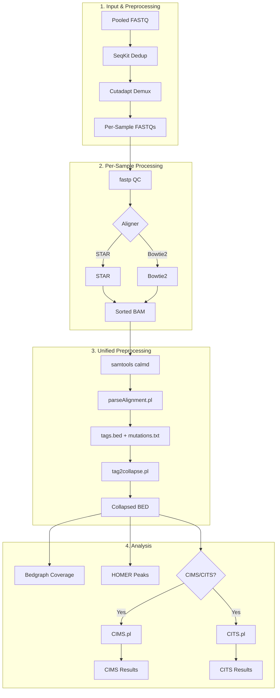

<p align="center">
  
</p>

# CLIPittyClip: Modern CLIP-seq Analysis Pipeline
**Version 3.0.0**

A comprehensive, single-command CLIP-seq data analysis pipeline from FASTQ to peaks and crosslink sites.

## Overview

CLIPittyClip v3.0 provides a complete, modernized workflow for CLIP-seq analysis:

- **Dual Aligner Support**: STAR (default) or Bowtie2
- **Unified Preprocessing**: `samtools calmd` → `parseAlignment.pl` → `tag2collapse.pl`
- **Integrated QC**: `fastp` for quality filtering, trimming, and UMI extraction
- **Demultiplexing**: Native barcode-based sample splitting with `cutadapt`
- **CIMS/CITS Analysis**: Zhang lab's CTK toolkit integration for crosslink site detection
- **Interactive Wizard**: `--wizard` mode for guided configuration
- **Flexible Output**: Conditional folder naming based on analysis type

## Pipeline Flow



> **Note**: Unified preprocessing always runs, generating `mutations.txt` for CIMS/CITS compatibility.

## Installation

> ⚠️ **Development Version**: This is the `v3-development` branch. For the stable release, use the `main` branch.

### 1. Clone Repository
```bash
git clone -b v3-development https://github.com/S00NYI/CLIPittyClip.git
cd CLIPittyClip
```

### 2. Create Conda Environment

> **Note:** Replace `[ENV_NAME]` with your preferred environment name (e.g., `clipittyclip`, `clip_env`, etc.)

#### Linux
```bash
mamba env create -n [ENV_NAME] -f install_linux.yml
```

#### macOS (Intel or Apple Silicon)

> [!IMPORTANT]
> **Why macOS requires special installation:**
> 
> The CTK (CLIP Tool Kit) and HOMER packages have incompatible Perl version requirements:
> - **CTK** requires `perl >=5.32.1`
> - **HOMER** requires `perl 5.22.0` or `perl 5.26.x`
> 
> Additionally, some CTK dependencies (like `xopen` via `cutadapt`) have broken builds for macOS on conda channels. These conflicts make it impossible to install both packages via conda on macOS.
> 
> The workaround is to:
> 1. Install core dependencies via conda (using x86 emulation via Rosetta 2)
> 2. Install CTK and HOMER manually from source

```bash
# Step 1: Create environment with x86 architecture (required for Rosetta compatibility)
CONDA_SUBDIR=osx-64 mamba create -n [ENV_NAME]
conda activate [ENV_NAME]
conda config --env --set subdir osx-64

# Step 2: Install core packages
mamba env update -f install_macos.yml

# Step 3: Install CTK and HOMER manually (see Section 3 below)
```

### 3. macOS: Manual CTK & HOMER Installation

> **Note:** The commands below install to `~/Tools/`. If this directory doesn't exist, it will be created automatically. You can change the installation path to any location you prefer.

**CTK (CLIP Tool Kit):**
```bash
# Create Tools directory if it doesn't exist
mkdir -p ~/Tools

# Clone CTK repository
git clone https://github.com/chaolinzhanglab/ctk.git ~/Tools/ctk

# Add CTK to your PATH and PERL5LIB
echo 'export PATH=$PATH:~/Tools/ctk' >> ~/.zshrc
echo 'export PERL5LIB=$PERL5LIB:~/Tools/ctk/czplib' >> ~/.zshrc
source ~/.zshrc
```

**HOMER:**
```bash
# Create HOMER directory and download installer
mkdir -p ~/Tools/homer && cd ~/Tools/homer
wget http://homer.ucsd.edu/homer/configureHomer.pl

# Install HOMER (this will download required data files)
perl configureHomer.pl -install

# Add HOMER to your PATH
echo 'export PATH=$PATH:~/Tools/homer/bin' >> ~/.zshrc
source ~/.zshrc
```

### 4. Activate Environment
```bash
# Replace [ENV_NAME] with the name you chose in Step 2
conda activate [ENV_NAME]

# Example:
# conda activate clipittyclip
```

### 5. Add CLIPittyClip to PATH (Optional)

To run CLIPittyClip commands from any directory:

```bash
# For zsh (macOS default)
bash install_zshrc.sh

# For bash (Linux default)
bash install_bashrc.sh
```

This adds the CLIPittyClip directory to your PATH and sets execute permissions on all scripts.

> **Note:** Restart your terminal or run `source ~/.zshrc` (or `source ~/.bashrc`) for the changes to take effect.

## Quick Start

```bash
# Basic analysis with STAR (single file)
CLIPittyClip.sh -i reads.fastq.gz -x /path/to/star_index -t 8 -u 7

# With demultiplexing
CLIPittyClip.sh -i pool.fastq.gz -b barcodes.txt -x /path/to/star_index -t 8

# Pre-demultiplexed samples in a folder
CLIPittyClip.sh -d /path/to/samples_folder/ -x /path/to/star_index -t 8

# Using Bowtie2 instead
CLIPittyClip.sh -i reads.fastq.gz -x /path/to/bt2_index -t 8 --aligner bowtie2

# With CIMS analysis only
CLIPittyClip.sh -i reads.fastq.gz -x /path/to/star_index -t 8 --cims

# With CITS analysis only
CLIPittyClip.sh -i reads.fastq.gz -x /path/to/star_index -t 8 --cits

# With both CIMS and CITS analysis
CLIPittyClip.sh -i reads.fastq.gz -x /path/to/star_index -t 8 --ctk
# OR equivalently:
CLIPittyClip.sh -i reads.fastq.gz -x /path/to/star_index -t 8 --cims --cits
```

## Input Modes

| Mode | Flag | Use Case |
|------|------|----------|
| Single file | `-i sample.fastq.gz` | One FASTQ, direct analysis |
| Pooled + barcodes | `-i pool.fastq.gz -b barcodes.txt` | Demultiplex then analyze |
| Pre-demuxed folder | `-d /path/to/folder/` | Batch analyze existing FASTQs |

## Command-Line Options

Run `CLIPittyClip.sh --help` for full usage. Key options:

| Option | Description |
|--------|-------------|
| `-i <path>` | Input FASTQ file (required unless using `-d`) |
| `-d <dir>` | Input directory with pre-demultiplexed FASTQs |
| `-x <path>` | Genome index directory (required) |
| `-t <int>` | Number of threads |
| `-u <int>` | UMI length (e.g., 7) |
| `--aligner` | `star` (default) or `bowtie2` |
| `-b <path>` | Barcode file for demultiplexing |
| `--mismatches` | Max barcode mismatches (default: 1) |
| `--cims` | Enable CIMS analysis |
| `--cits` | Enable CITS analysis |
| `--cims-fdr` | CIMS FDR threshold (default: 1) |
| `--cits-pval` | CITS p-value threshold (default: 1) |
| `-g, --groups` | Aggregate samples by group for CIMS/CITS |
| `--no-dedup` | Disable pooled read deduplication |
| `--sample <int>` | Test mode (first N reads) |
| `--wizard` | Interactive configuration wizard |

## Group-Based CIMS/CITS Analysis

Use `-g groups.txt` to aggregate replicates/samples before running CIMS/CITS:

```bash
CLIPittyClip.sh -i pool.fq.gz -b barcodes.txt -x index --cims --cits -g groups.txt
```

**groups.txt format** (tab-separated: `SampleName<TAB>GroupName`):
```
Condition_A_Rep1    Condition_A
Condition_A_Rep2    Condition_A
Condition_B_Rep1    Condition_B
Condition_B_Rep2    Condition_B
```

> **Note:** Samples not listed in the groups file are treated as individual groups (analyzed separately).

## Output Structure

```
{INPUT}_output/
├── 0_DEMUX_FASTQ/           # Demultiplexed reads
├── 1_BAM/                   # Aligned BAM files
├── 2_COLLAPSED_BED/         # PCR-deduplicated BED
├── 3_BEDGRAPH/              # Coverage tracks
├── 4_PEAKS/                 # HOMER peak results
│   ├── Combined_peaks/
│   └── SAMPLE_PEAKS/
│
├── 5_CTK_Analysis/          # When --cims --cits (both)
│   ├── CIMS/
│   ├── CITS/
│   └── motif_analysis/
│ OR
├── 5_CIMS_Analysis/         # When --cims only
│ OR
├── 5_CITS_Analysis/         # When --cits only
│
├── 6_OTHERS/                # When CTK analysis enabled
│   └── STAR_OUTPUT/
│ OR
├── 5_OTHERS/                # When no CTK analysis
│   └── STAR_OUTPUT/
│
└── REPORTS/                 # Logs and QC reports
```

## Console Output

```
[DEDUPLICATING]
  > Deduplicating Pooled Reads (SeqKit)
  > Deduplicating Complete

[DEMULTIPLEXING]
  > Barcodes: barcodes.txt
  > Mismatches Allowed: 2
  > Checking barcodes...
  > All barcodes are unique with 2 mismatches.
  > Demultiplexing Complete

[BATCH ANALYSIS]
   1/3 Sample1 : Preprocessing > Mapping (STAR) > Processing Alignment > Collapsing > Bedgraph > Peaks > CIMS > CITS > Done!
```

## Standalone Tools

### MAPittyMap.sh
Standalone mapping module for aligning FASTQ files to a reference genome.

**Required inputs:**
- `-i <path>`: Input FASTQ file (gzipped)
- `-x <path>`: Path to genome index directory

**Key options:**
- `-t <int>`: Number of threads (default: 1)
- `--aligner <star|bowtie2>`: Alignment tool (default: star)
- `-o <path>`: Output directory
- `--wizard`: Launch interactive configuration wizard

```bash
# Using STAR
MAPittyMap.sh -i reads.fastq.gz -x /path/to/star_index -t 8 --aligner star

# Using Bowtie2
MAPittyMap.sh -i reads.fastq.gz -x /path/to/bt2_index -t 8 --aligner bowtie2

# Interactive wizard mode for custom aligner settings
MAPittyMap.sh -i reads.fastq.gz -x /path/to/star_index -t 8 --wizard
```

---

### PEAKittyPeak.sh
Standalone peak calling using HOMER. Requires a directory containing collapsed BED files.

**Required inputs:**
- Run from a directory containing a `BED/` folder with `.bed` files

**Key options:**
- `-p <int>`: Min distance between peaks (default: 50)
- `-z <int>`: Peak size (default: 20)
- `-f <int>`: Fragment length (default: 25)
- `-n <string>`: Output name prefix
- `-a <string>`: Additional HOMER findPeaks arguments
- `--wizard`: Launch interactive HOMER configuration wizard

```bash
# Basic peak calling
PEAKittyPeak.sh -p 50 -z 20 -n Combined

# With custom HOMER arguments
PEAKittyPeak.sh -n Combined -a '-style factor -L 2'

# Interactive wizard mode for HOMER settings
PEAKittyPeak.sh --wizard
```

## Generating Genome Indices

### STAR Index
```bash
STAR --runMode genomeGenerate \
     --runThreadN 8 \
     --genomeDir /path/to/star_index \
     --genomeFastaFiles genome.fa \
     --sjdbGTFfile annotation.gtf \
     --sjdbOverhang 100
```

### Bowtie2 Index
```bash
bowtie2-build genome.fa /path/to/bt2_index/GRCh38
```

### ncRNA Pre-filtering Index (Optional but Recommended)

CLIPittyClip automatically filters ncRNA reads (rRNA, tRNA, snRNA, snoRNA) before genome alignment to improve peak calling accuracy. This is **enabled by default**.

**Setup:** Place a Bowtie2 index with prefix `ncrna` in your annotation directory (same location as `-x`).

**Building the ncRNA index:**

1. Download ncRNA sequences from Ensembl:
```bash
# Human (GRCh38)
wget ftp://ftp.ensembl.org/pub/release-110/fasta/homo_sapiens/ncrna/Homo_sapiens.GRCh38.ncrna.fa.gz
gunzip Homo_sapiens.GRCh38.ncrna.fa.gz

# Mouse (GRCm39)
wget ftp://ftp.ensembl.org/pub/release-110/fasta/mus_musculus/ncrna/Mus_musculus.GRCm39.ncrna.fa.gz
gunzip Mus_musculus.GRCm39.ncrna.fa.gz
```

2. Build Bowtie2 index (place in same directory as genome index):
```bash
bowtie2-build Homo_sapiens.GRCh38.ncrna.fa /path/to/annotation/ncrna
```

**Behavior:**
- If `ncrna.1.bt2` found: Filters ncRNA reads, saves to `OTHERS/ncRNA_Mapping/`
- If index not found: Prints warning, continues without filtering

**To disable:** Use `--skip-ncrna` flag


## License

GPL-3.0 License - See [LICENSE](LICENSE) for details.
