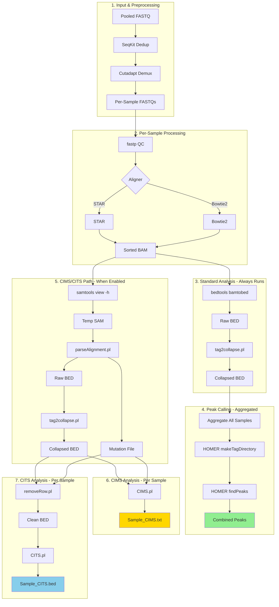
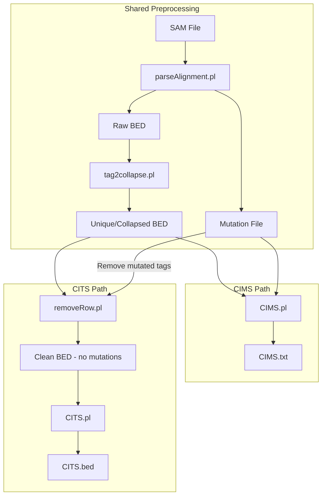

# CLIPittyClip v3.0 Technical Documentation

This document provides comprehensive technical documentation for the CLIPittyClip CLIP-seq analysis pipeline, including pipeline features, CIMS/CITS integration specifications, and file format details.

---

## Table of Contents
1. [Pipeline Overview](#pipeline-overview)
2. [Key Features](#key-features)
3. [Pipeline Flow](#pipeline-flow)
4. [Output Directory Structure](#output-directory-structure)
5. [CIMS/CITS Analysis](#cimscipts-analysis)
6. [File Format Specifications](#file-format-specifications)
7. [Advanced Configuration Mode](#advanced-configuration-mode)
8. [Standalone Scripts](#standalone-scripts)
9. [Troubleshooting](#troubleshooting)

---

## Pipeline Overview

CLIPittyClip is a streamlined bash pipeline for analyzing CLIP-seq data. Version 3.0 introduces:
- Modular architecture (`lib/modules.sh`, `lib/utils.sh`, `lib/wizard.sh`)
- Dual aligner support (STAR/Bowtie2)
- Integrated CIMS/CITS analysis from CTK toolkit
- Interactive configuration wizard
- Robust error handling and recovery

---

## Key Features

### 1. Dual Aligner Support
- **STAR** (default): `--aligner star`
- **Bowtie2**: `--aligner bowtie2`
- Automatic index validation before mapping
- MD tag generation for both aligners (required for CIMS/CITS)

### 2. Demultiplexing & Deduplication
- **Deduplication**: `seqkit rmdup` collapses identical reads before processing
  - Default: ON (`--dedup`)
  - Disable: `--no-dedup`
- **Demultiplexing**: Uses `cutadapt` with barcode file (`-b <barcode.txt>`)
  - Configurable mismatches: `--mismatches <int>` (default: 1)
  - Recursive batch processing for multi-sample runs

### 3. Error Recovery
- **FASTQ Repair**: Auto-sanitizes corrupted reads if `fastp` fails
- **Exit Code Propagation**: Proper error detection via `PIPESTATUS`

### 4. System Notifications
- `--notification` flag enables macOS alerts on completion

---

## Pipeline Flow



> [!NOTE]
> **Standard path (3-4) always runs** for peak calling. CIMS/CITS path (5-7) runs **in parallel** when enabled, using a temp SAM derived from the same BAM.

### Flow Summary

| Stage | Standard Path | CIMS/CITS Path |
|-------|---------------|----------------|
| **Alignment** | STAR or Bowtie2 → BAM | Same |
| **BED Conversion** | `bedtools bamtobed` | `parseAlignment.pl` (requires SAM) |
| **Mutation Tracking** | ❌ Not captured | ✅ Saved to mutation file |
| **Collapse** | `tag2collapse.pl` | Same |
| **Peak Calling** | ✅ HOMER | ✅ HOMER |
| **CIMS** | ❌ | ✅ Uses collapsed BED + mutations |
| **CITS** | ❌ | ✅ First filters out mutated reads |

---

## Output Directory Structure

```
{INPUT_NAME}_output/
│
├── 0_DEMUX_FASTQ/                    # Demultiplexed raw reads
│   ├── Sample1.fastq.gz
│   └── Sample2.fastq.gz
│
├── 1_BAM/                            # Aligned BAM files
│   ├── Sample1.Aligned.sortedByCoord.out.bam
│   ├── Sample1.Aligned.sortedByCoord.out.bam.bai
│   └── ...
│
├── 2_COLLAPSED_BED/                  # PCR-collapsed unique tags
│   ├── Sample1_collapsed.bed
│   └── Sample2_collapsed.bed
│
├── 3_BEDGRAPH/                       # Coverage tracks
│   ├── Sample1_pos.bedgraph
│   ├── Sample1_neg.bedgraph
│   └── chrom.sizes
│
├── 4_PEAKS/                          # Peak calling results
│   ├── COMBINED_PEAKS/               # Aggregated analysis
│   │   ├── peaks.bed
│   │   ├── peaks_Sorted.bed
│   │   └── Combined_TagDir/
│   └── SAMPLE_PEAKS/                 # Individual sample peaks
│       ├── Sample1_peaks/
│       └── Sample2_peaks/
│
├── 5_CIMS/                           # CIMS analysis outputs
│   ├── Sample1_CIMS.txt
│   ├── Sample2_CIMS.txt
│   └── mutations/
│       ├── Sample1_mutations.bed
│       └── Sample2_mutations.bed
│
├── 6_CITS/                           # CITS analysis outputs
│   ├── Sample1_CITS.bed
│   └── Sample2_CITS.bed
│
├── 7_OTHERS/                         # Misc outputs
│   └── STAR_OUTPUT/
│       └── *.SJ.out.tab
│
└── REPORTS/                          # Logs and QC reports
    ├── FASTP_REPORT/
    ├── STAR_LOGS/
    ├── PEAK/
    │   └── INDIVIDUAL_SAMPLES/
    ├── CIMS_CITS/
    └── {INPUT}_pipeline.log
```

---

## CIMS/CITS Analysis

### Biological Background

| Analysis | What it Detects | Biological Basis |
|----------|-----------------|------------------|
| **CIMS** | Mutation sites (deletions/substitutions) | UV crosslinks cause RT to introduce errors at crosslink positions |
| **CITS** | Truncation sites (5' read ends) | UV crosslinks cause RT to stop/terminate at crosslink positions |

### Workflow Differences



### Key Difference: CITS Removes Mutated Tags

CITS first removes tags that have mutations (those are CIMS candidates):
- CIMS = reads with **mutations** (RT made errors at crosslink)
- CITS = reads with **truncations** (RT stopped at crosslink)
- A read cannot be both, so CITS excludes mutated reads

### Input Requirements

| Input | CIMS.pl | CITS.pl | Notes |
|-------|---------|---------|-------|
| `tag.bed` | ✅ Collapsed BED | ❌ | All unique tags |
| `mutation.bed` | ✅ Required | ⚠️ Used to filter | From parseAlignment.pl |
| `uniq.tag.bed` | ❌ | ✅ Filtered tags | Tags WITHOUT mutations |

### Command Signatures

**CIMS.pl:**
```bash
CIMS.pl [options] <tag.bed> <mutation.bed> <out.txt>
# tag.bed      = collapsed unique tags
# mutation.bed = mutations from parseAlignment.pl
# out.txt      = significant CIMS positions
```

**CITS.pl:**
```bash
CITS.pl [options] <uniq.tag.bed> <uniq.mutation.bed> <out.CITS.bed>
# uniq.tag.bed     = collapsed tags
# uniq.mutation.bed = used to EXCLUDE mutated reads
# out.CITS.bed     = significant CITS positions
```

---

## File Format Specifications

### parseAlignment.pl Options

| Option | Required? | Description |
|--------|-----------|-------------|
| `--mutation-file <file>` | **YES** | Output file for mutations |
| `--map-qual <int>` | Recommended | MAPQ threshold (e.g., 1 for unique) |
| `--min-len <int>` | Recommended | Minimum read length |
| `--split-del` | Optional | Split multi-nt deletions |
| `-v` | Optional | Verbose output |

### CIMS.txt Output Format

**Header:**
```
#chrom  chromStart  chromEnd  name  score  strand  tagNumber(k)  mutationFreq(m)  FDR  count(>=m,k)
```

**Columns:**
| Col | Name | Description |
|-----|------|-------------|
| 1-3 | chrom, start, end | Genomic coordinates |
| 4 | name | Site ID with `[k=X][m=Y]` annotation |
| 5 | score | Score value |
| 6 | strand | +/- |
| 7 | tagNumber(k) | Number of tags at position |
| 8 | mutationFreq(m) | Number of mutations |
| 9 | FDR | False discovery rate |
| 10 | count(>=m,k) | Cumulative count |

**Example:**
```
chr1  12345  12346  site1[k=50][m=5]  100  +  50  5  0.001  25
chr1  23456  23457  site2[k=30][m=3]  75   -  30  3  0.05   100
```

### CITS.bed Output Format

Standard BED format with significant truncation sites.

### Files Generated for CIMS/CITS

| File | Generated By | Used By |
|------|-------------|---------|
| `{sample}.sam` | samtools view -h | parseAlignment.pl (temp) |
| `{sample}_raw.bed` | parseAlignment.pl | tag2collapse.pl |
| `{sample}_mutations.bed` | parseAlignment.pl | CIMS.pl, CITS.pl |
| `{sample}_collapsed.bed` | tag2collapse.pl | CIMS.pl, CITS.pl |
| `{sample}_CIMS.txt` | CIMS.pl | Final output |
| `{sample}_CITS.bed` | CITS.pl | Final output |

---

## Advanced Configuration Mode

Interactive wizard for power users (`--advanced` flag).

**Features:**
- Step-by-step parameter configuration
- Cheat sheets for `fastp`, `STAR`, `Bowtie2`, `HOMER`
- Input validation against tool help text
- Configuration saved to `analysis_config.env`

**Example:**
```bash
CLIPittyClip.sh -i input.fastq.gz -x /path/to/index -t 8 --advanced
```

---

## Standalone Scripts

### MAPittyMap.sh
Standalone mapping module.
- Supports `--aligner star` (default) and `--aligner bowtie2`
- Creates `1_BAM/` and `REPORTS/` folders
- Supports `--advanced` for configuration wizard

### PEAKittyPeak.sh
Standalone peak calling module.
- Uses HOMER (`makeTagDirectory` + `findPeaks`)
- Supports advanced HOMER arguments
- Supports `--advanced` for configuration wizard

---

## Troubleshooting

> [!IMPORTANT]
> **Perl on Apple Silicon**: CTK scripts use Conda's Perl to avoid `Math::CDF` issues on M1/M2/M3.

> [!TIP]
> **Deduplication**: Runs by default. Use `--no-dedup` if you suspect over-collapsing.

> [!NOTE]
> **MD Tags**: Both STAR and Bowtie2 generate MD tags for CIMS/CITS compatibility. Bowtie2 uses `--sam-opt-config 'md'`.

> [!WARNING]
> **CIMS/CITS Status**: Currently under active development. Implementation uses Option B approach (BAM→SAM conversion when needed).

---

## Implementation Notes

### BAM to SAM Conversion for CIMS/CITS

Since `parseAlignment.pl` requires SAM input, the pipeline converts BAM→SAM only when CIMS/CITS is enabled:

```bash
# In run_parse_alignment()
samtools view -h "$bam_file" > "$sam_file"
parseAlignment.pl --mutation-file "$mutation_file" "$sam_file" "$output_bed"
```

This avoids unnecessary format conversions in the standard (non-CIMS) path.
